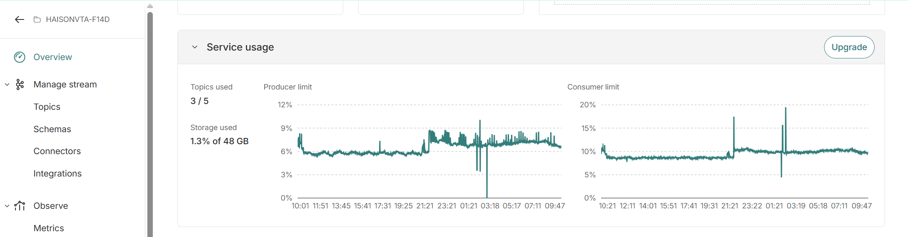
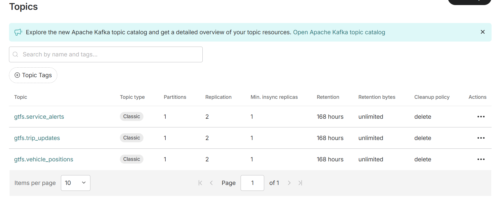
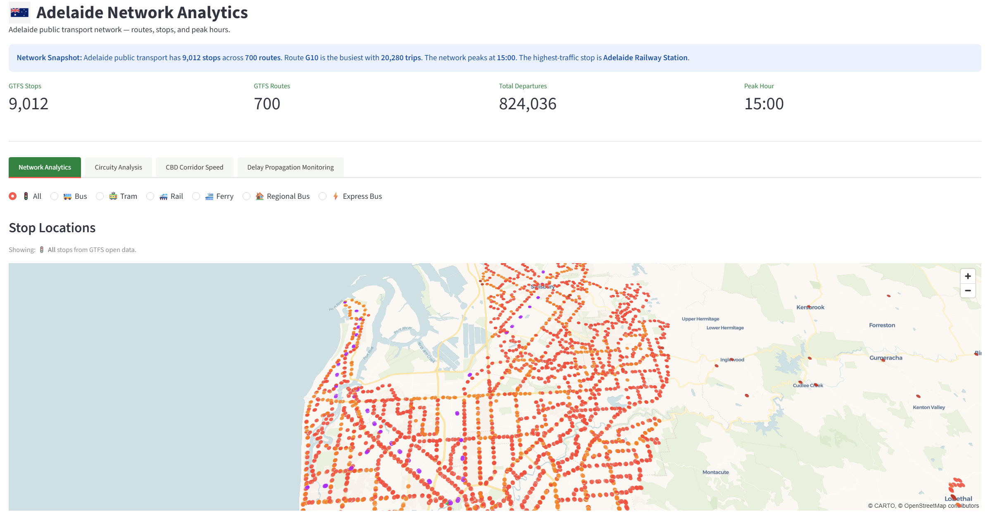
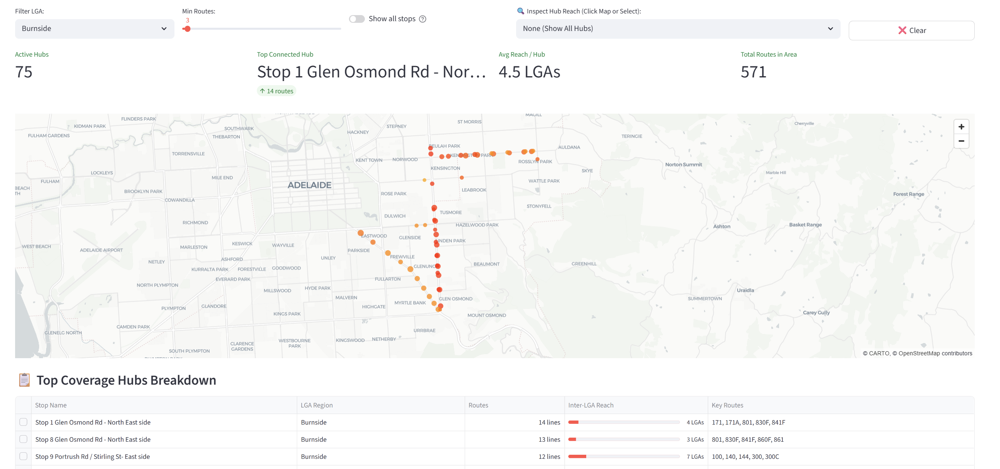
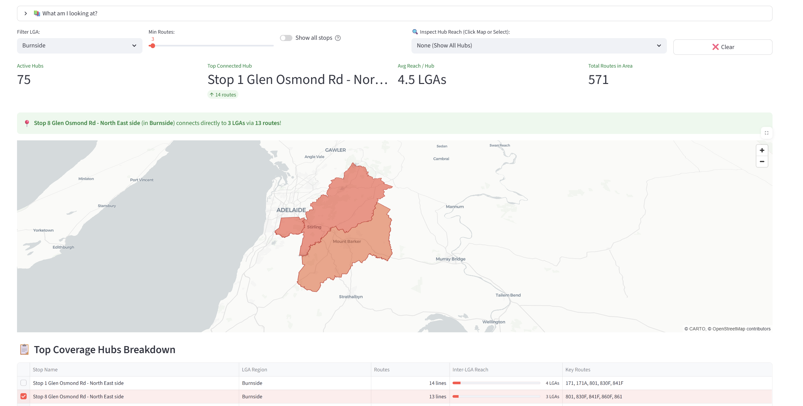
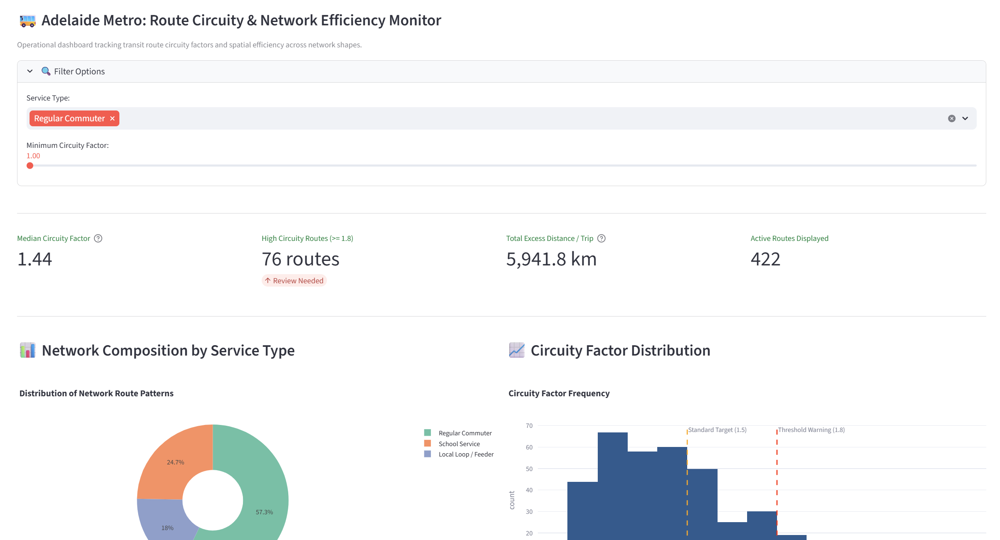
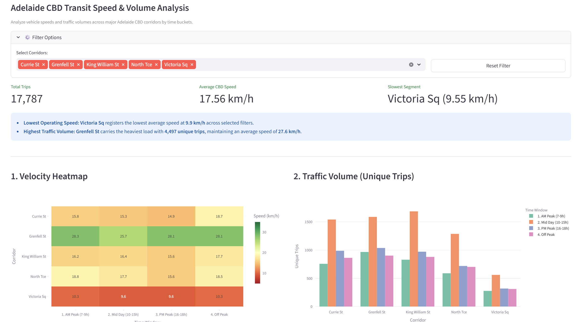
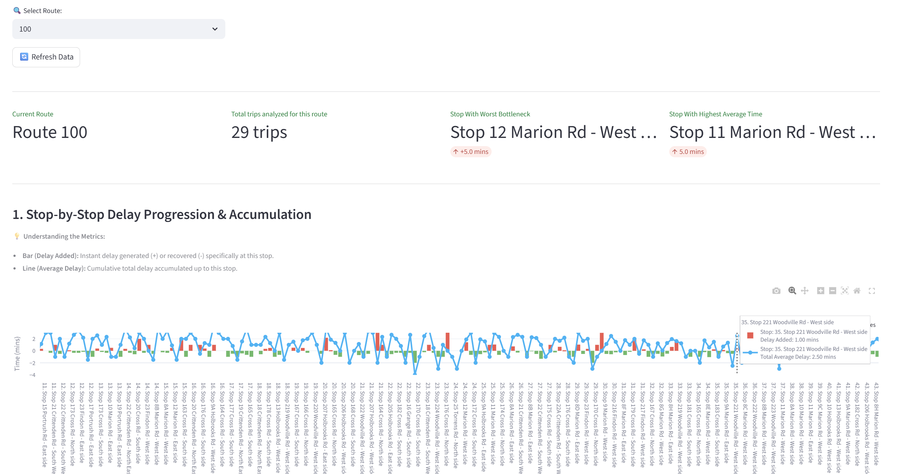
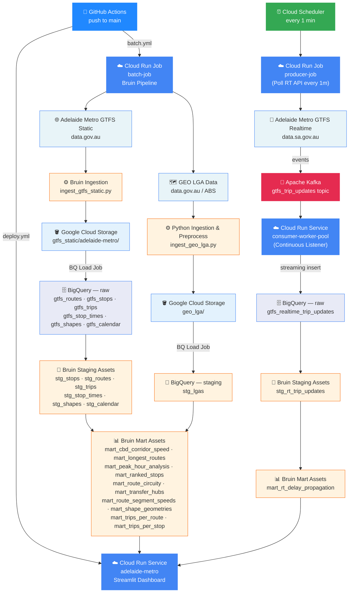

# 🚌 Adelaide Transit Pulse

[]()
[]()
[]()
[]()

🚀 **[Live Dashboard → ](https://adelaide-metro-162176027068.asia-east2.run.app/)**

---

## Problem Statement

Adelaide Metro publishes GTFS static and GTFS-Realtime feeds, but raw feed data alone doesn't answer the operational questions that matter to planners and commuters. This project turns that raw feed into three concrete analytical answers, each corresponding to a dashboard tab:

### 1. Network Analytics — Is the network structured efficiently?
Static GTFS gives stops and routes, but not *how direct* those routes actually are relative to demand. **Circuity factor** (actual path length vs. geodesic span to the farthest stop) surfaces routes that loop excessively — a proxy for route design efficiency.

### 2. CBD Corridor Speed — Where does traffic actually bottleneck?
Combining scheduled trip times with stop-to-stop geospatial distance reveals realized speed per CBD corridor segment, exposing where the network underperforms relative to its designed schedule.

### 3. Delay Propagation Monitoring — Do delays cascade, and where do they start?
GTFS-Realtime `trip_updates` vs. scheduled `stop_times.txt` isolates root-cause stops where delay originates, then tracks how that delay compounds across downstream stops on the same trip.

---

## Overview

Adelaide Transit Pulse is an end-to-end data pipeline that ingests GTFS static and GTFS-Realtime feeds from Adelaide Metro, transforms them through a layered SQL model in BigQuery, and surfaces insights via an interactive Streamlit dashboard — including a 3D pydeck map for route/stop geometry that standard chart libraries can't render.

The pipeline runs on Bruin, pulling GTFS static (updated periodically) and GTFS-RT `trip_updates` (polled at short intervals), loading into BigQuery raw → staging → marts layers, and visualising across a two-view dashboard: schedule (batch) analysis and real-time delay monitoring.

---

## Table of Contents

- [Tech Stack](#tech-stack)
- [Architecture](#architecture)
- [Project Structure](#project-structure)
- [Data Sources](#data-sources)
- [Data Pipeline](#data-pipeline)
- [Insights & Visualizations](#insights--visualizations)
- [Steps to Reproduce](#steps-to-reproduce)
- [About](#about)

---

## Tech Stack

<p align="center">
  
</p>

| Layer          | Tool                  | Purpose                                      |
|----------------|-----------------------|-----------------------------------------------|
| Orchestration | Bruin | Pipeline orchestration + SQL transformations |
| Infrastructure | Terraform | Provision GCS, BigQuery, service accounts |
| Data Lake | Google Cloud Storage | Raw bucket for static GTFS |
| Data Warehouse | BigQuery | raw → staging → marts layers |
| Streaming |  Apache Kafka | Real-time trip update events via Aiven |
| Visualization | Streamlit + pydeck | Interactive dashboard (4 tabs) |
| Containerization | Docker | Container images for dashboard, batch, and streaming |
| Deployment | Google Cloud Run | Dashboard (Service) + Batch + Streaming (Jobs) |
| CI/CD | GitHub Actions + WIF | Auto-deploy on push to main |
| Scheduling | Cloud Scheduler | Trigger streaming jobs (1 min) + batch job (daily) |
| Cloud | GCP Free Tier | Compute, storage, and warehouse |
| Language | Python 3.11 | Ingestion scripts and dashboard |

### Why These Technologies?

**BigQuery** — Chosen for serverless geospatial functions (`ST_MakeLine`, `ST_Length`, `ST_Distance`) needed for circuity and corridor-speed calculations, without managing infrastructure.

**Bruin** — Unifies YAML-defined job orchestration and SQL assets under one CLI (`bruin run`), making raw → staging → marts dependency resolution explicit and reproducible.

**Apache Kafka (Hosted on Aiven)** - An open-source distributed event streaming platform used to bridge the gap between the Adelaide Metro GTFS Realtime API (polled every minute) and BigQuery. The producer worker pool publishes real-time transit updates to the adelaide-transit-rt topic, while the continuous consumer worker pool drains these events into BigQuery for real-time analysis.

| Overview | Topics |
|---|---|
|  |  |
| Aiven Kafka cluster metrics for Adelaide Metro — showing topic/storage usage, producer rate, and consumer throughput | Three topics in use: `gtfs.vehicle_positions` for real-time vehicle positions, `gtfs.trip_updates` for real-time trip updates, and `gtfs.service_alerts` for service alerts |

**Streamlit** — Chosen for rapid dashboard development in pure Python, with `pydeck` support for 3D geospatial rendering (route shapes, stop density) that standard BI tools don't handle well.
| Tabs | Captures | Description 
|---|---|---|
| Network Analytics |    | Stop location maps, busiest routes, coverage hubs filtered by Local Government Areas (LGAs) | 
| Circuity Analysis |  | Operational dashboard tracking transit route circuity factors and spatial efficiency across network shapes. |
| CBD speed analysis |  | Analyze vehicle speeds and traffic volumes across major Adelaide CBD corridors by time buckets.|
| Delay & Propagation Analytics |  | Real-time event volume, tracking how delays start at one stop and build up across the route. |

---

## Architecture

---

## Project Structure
```
adelaide-metro/
├── Dockerfile                          # Dashboard container image
├── .dockerignore
├── requirements.txt                    # Python dependencies
├── .github/
│   └── workflows/
│       ├── deploy.yml                  # CI/CD: build + deploy dashboard on push to main
│       └── batch.yml                   # CI/CD: build + run batch job (daily at 06:00 HKT)
├── bruin/                              # Batch pipeline (Bruin)
│   ├── Dockerfile                      # Batch container image
│   ├── .bruin.yml                      # Bruin GCP connection config (gitignored)
│   ├── .bruin.yml.example
│   ├── pipeline.yml                    # Pipeline definition + daily schedule
│   └── assets/
│       ├── ingestion/
│       │   ├── ingest_gtfs_static.py   # Download GTFS Protobuf -> GCS -> BigQuery
│       ├── staging/
│       │   ├── stg_stops.sql
│       │   ├── stg_routes.sql
│       │   ├── stg_trips.sql
│       │   ├── stg_stop_times.sql
│       │   ├── stg_rt_service_alerts.sql
│       │   ├── stg_rt_trip_updates.sql
│       │   ├── stg_rt_vehicle_positions.sql
│       │   └── stg_calendar.sql
│       └── marts/
│           ├── mart_cbd_corridor_speed.sql
│           ├── mart_longest_routes.sql
│           ├── mart_peak_hour_analysis.sql
│           ├── mart_ranked_stops.sql
│           ├── mart_route_circuity.sql
│           ├── mart_transfer_hubs.sql
│           ├── mart_route_segment_speeds.sql
│           ├── mart_rt_delay_propagation.sql
│           ├── mart_shape_geometries.sql
│           ├── mart_trips_per_route.sql
│           └── mart_trips_per_stop.sql
├── dashboard/
│   └── App.py                          # Streamlit dashboard (3 tabs)
├── streaming/
│   ├── producer.py                     # One-shot: poll GTFS-RT API -> Kafka
│   └── consumer.py                     # One-shot: Kafka -> BigQuery
└── terraform/
    ├── main.tf                         # GCS + BigQuery + service account + IAM
    ├── variables.tf
    ├── outputs.tf
    └── terraform.tfvars.example
```

## Data Sources

### Adelaide Metro GTFS Static
| File | Contents |
|---|---|
| `shapes.txt` | Route shape geometry (used for circuity) |
| `stops.txt` | Stop locations |
| `stop_times.txt` | Scheduled arrival/departure per stop |
| `routes.txt`, `trips.txt` | Route/trip metadata |

### Adelaide Metro GTFS-Realtime
| Feed | Contents |
|---|---|
| `trip_updates` | Actual/predicted arrival-departure times per stop |

---

## Data Pipeline

### 1. Staging
Cleans and types raw GTFS files; groups shapes by `(shape_id, feed_version_id)` to handle schema evolution across feed updates.

### 2. Marts
- `mart_route_circuity` — actual path length vs. geodesic span
- `mart_cbd_corridor_speed` — realized speed per CBD segment vs. scheduled
- `mart_delay_propagation` — delay at origin stop vs. downstream stops (window functions on `stop_sequence`)

### 3. Dashboard
Streamlit app queries marts directly via the BigQuery Python client, rendering 3 tabs (Network Analytics, CBD Corridor Speed, Delay Propagation Monitoring) plus a 3D pydeck map for route geometry.

---

## Insights & Visualizations

**Network Analytics** — Circuity factor by route, ranked; geodesic span methodology explained; 3D pydeck map of route shapes and stop density.

**CBD Corridor Speed** — Scheduled vs. realized speed per corridor segment, volume overlay.

**Delay Propagation Monitoring** — Root-cause stop identification, delay cascade across downstream stops on the same trip.

---
