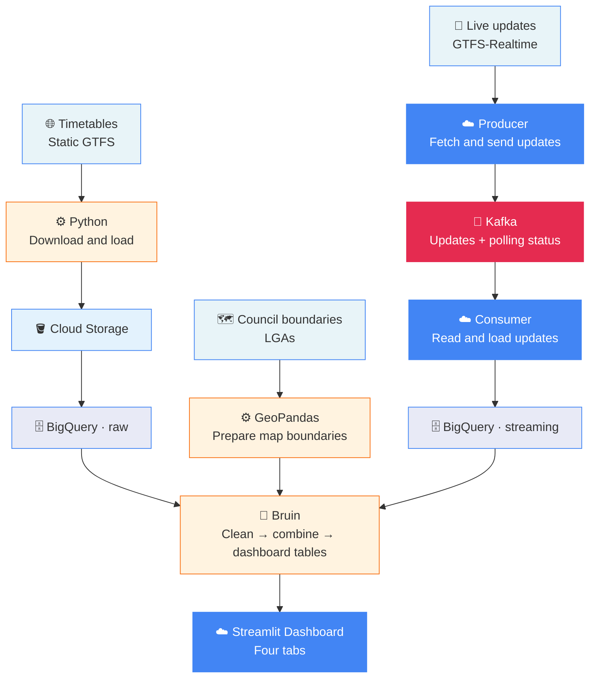

# 🚌 Adelaide Transit Pulse

**Adelaide public transport analytics**


🚀 **[Live Dashboard → CLICK HERE](https://adelaide-metro-162176027068.asia-east2.run.app/)**

Explore Adelaide's public transport network: where scheduled services are busiest, how direct routes are, and how delays change along a trip.

---

## Problem Statement

Public transport data often comes as separate timetables and live updates. This project brings them together with Local Government Area (LGA) boundaries — the areas managed by local councils — to explore routes, stops, and connections across Adelaide.

**GTFS** (General Transit Feed Specification) is a standard format for routes, stops, and timetables. **GTFS-Realtime** adds live updates about vehicle locations, expected arrivals, and service alerts.

Python downloads the data, Kafka carries live updates, and Bruin prepares BigQuery tables for four Streamlit dashboard tabs.

[Architecture](#architecture) · [Dashboard](#dashboard) · [Quick Start](#quick-start) · [Setup guide](docs/setup.md) · [Data model](docs/data-model.md)

---

## Architecture


```mermaid
flowchart TD
    STATIC["🌐 Timetables\nStatic GTFS"] --> INGEST["⚙️ Python\nDownload and load"]
    INGEST --> GCS["🪣 Cloud Storage"]
    GCS --> RAW["🗄️ BigQuery · raw"]
    LGA["🗺️ Council boundaries\nLGAs"] --> GEO["⚙️ GeoPandas\nPrepare map boundaries"]
    API["📡 Live updates\nGTFS-Realtime"] --> PROD["☁️ Producer\nFetch and send updates"]
    PROD --> KAFKA["📨 Kafka\nUpdates + polling status"]
    KAFKA --> CONS["☁️ Consumer\nRead and load updates"]
    CONS --> STREAM["🗄️ BigQuery · streaming"]
    RAW --> BRUIN["🔧 Bruin\nClean → combine → dashboard tables"]
    GEO --> BRUIN
    STREAM --> BRUIN
    BRUIN --> APP["☁️ Streamlit Dashboard\nFour tabs"]

    style STATIC fill:#e8f4f8,stroke:#4285F4
    style LGA fill:#e8f4f8,stroke:#4285F4
    style API fill:#e8f4f8,stroke:#4285F4
    style INGEST fill:#fff3e0,stroke:#F97316
    style GEO fill:#fff3e0,stroke:#F97316
    style BRUIN fill:#fff3e0,stroke:#F97316
    style GCS fill:#e3f2fd,stroke:#4285F4
    style RAW fill:#e8eaf6,stroke:#4285F4
    style STREAM fill:#e8eaf6,stroke:#4285F4
    style KAFKA fill:#E52B50,color:#fff,stroke:#E52B50
    style PROD fill:#4285F4,color:#fff,stroke:#4285F4
    style CONS fill:#4285F4,color:#fff,stroke:#4285F4
    style APP fill:#4285F4,color:#fff,stroke:#4285F4
```

GitHub Actions runs the full pipeline daily. The producer and consumer run continuously on Cloud Run Worker Pools; Cloud Scheduler rebuilds the delay tables every five minutes. [Full architecture and update schedule →](docs/data-model.md#architecture)

---

## Tech Stack

| Layer | Tools |
| --- | --- |
| Data collection & live updates | Python, GeoPandas, Kafka / Aiven |
| File storage & database | Cloud Storage, BigQuery |
| Data processing & scheduling | Bruin, Cloud Scheduler |
| Dashboard | Streamlit, Plotly, pydeck |
| Cloud setup & deployment | Terraform, Docker, Cloud Run, GitHub Actions |

---

## Dashboard

| Tab | Capture | What it shows |
| --- | --- | --- |
| **Network Analytics** |  | Where scheduled services are busiest, and which council areas can be reached by staying on the same trip. |
| **Circuity Analysis** |  | How direct a route is: its length compared with the distance from its first stop to its farthest stop. |
| **CBD Corridor Speed** |  | Timetable-based speed and trip counts along streets in the central business district (CBD), by time of day. |
| **Delay Propagation Monitoring** |  | How arrival delays grow or recover as a trip moves from stop to stop. |

Counts come from the loaded timetable. CBD speed uses scheduled travel times, and live arrival updates may be predictions. [How the measures are calculated →](docs/data-model.md#metric-semantics)

<details>
<summary>More screenshots & tech stack diagram</summary>

| Connections across council areas | Council-area map |
| --- | --- |
|  |  |

| Aiven Kafka | Topics |
| --- | --- |
|  |  |

<p align="center">
  
</p>

</details>

---

## Project Structure

```
adelaide-metro/
├── bruin/               # Collect, clean, combine and prepare dashboard data
├── streaming/           # Send and load live updates through Kafka
├── dashboard/           # Streamlit app
├── terraform/           # Google Cloud resources and update schedule
├── .github/workflows/   # Checks, deployment and daily pipeline run
├── tests/               # Producer/consumer unit tests
└── docs/                # Setup, data model, diagrams and screenshots
```

[Detailed directory tree →](docs/data-model.md#project-structure)

---

## Quick Start

**First-time setup:** follow [docs/setup.md](docs/setup.md) to configure Google Cloud Platform (GCP), Bruin, and Kafka, then build the database tables. SQL currently contains project IDs that must be updated for your own project.

**With the database tables already built:** run these commands from the project folder using Bash (or WSL on Windows) and Python 3.11:

```bash
python -m venv .venv
source .venv/bin/activate
python -m pip install -r requirements.txt
gcloud auth application-default login
export GOOGLE_CLOUD_PROJECT="your-project-id"
streamlit run dashboard/App.py
```

The dashboard reads prepared BigQuery tables, called **marts**. These must already exist in your project. [Deployment, schedules, and checks →](docs/setup.md#deployment--scheduling)

---

## What Can Be Improved

- **Easier setup:** Project IDs are repeated across SQL and deployment files, and some cloud resources still need manual setup. Use one shared configuration and automate those steps so another user can run the project with fewer edits.
- **More reliable live updates:** A restart can cause the same update to be loaded again, and a failed worker can stop new data from arriving. Handle repeated records, restart failed workers, and show the last update time so users can tell whether the dashboard is current.
- **Repeatable data loads:** Static downloads replace the current tables, and only a source-change hash is saved. Keep versioned copies of source files so a failed load can be retried with the same input and earlier results can be reproduced.
- **Cost control:** Live workers run continuously, and repeated database loads and queries add costs. Monitor usage and tune batch sizes, refresh intervals, and storage retention to keep operating costs predictable.

[Pipeline limitations →](docs/data-model.md#what-can-be-improved)
