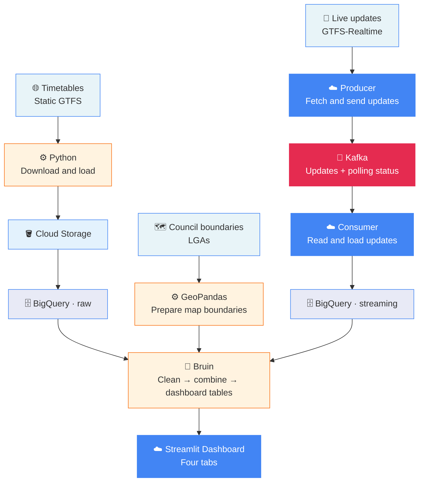
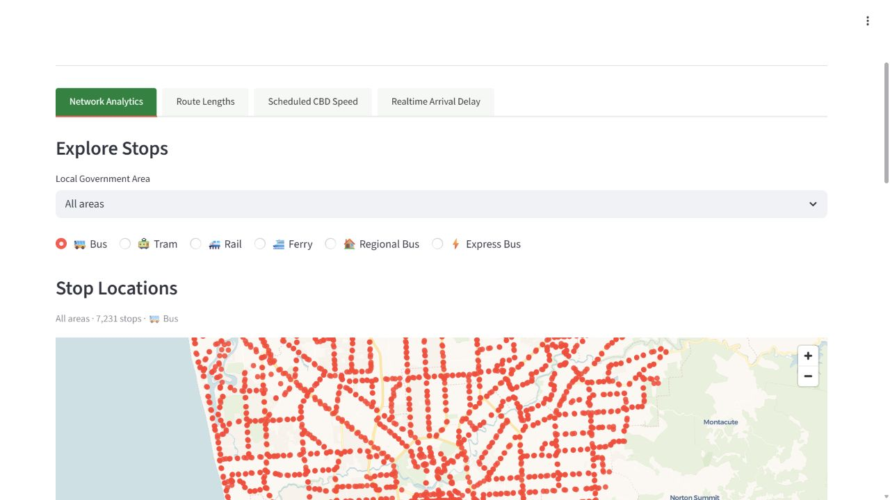
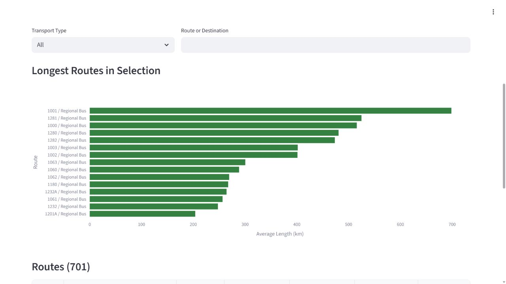
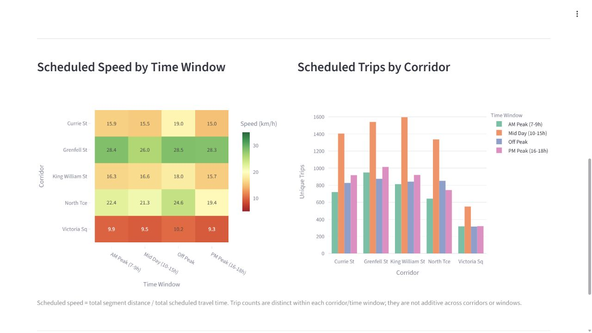
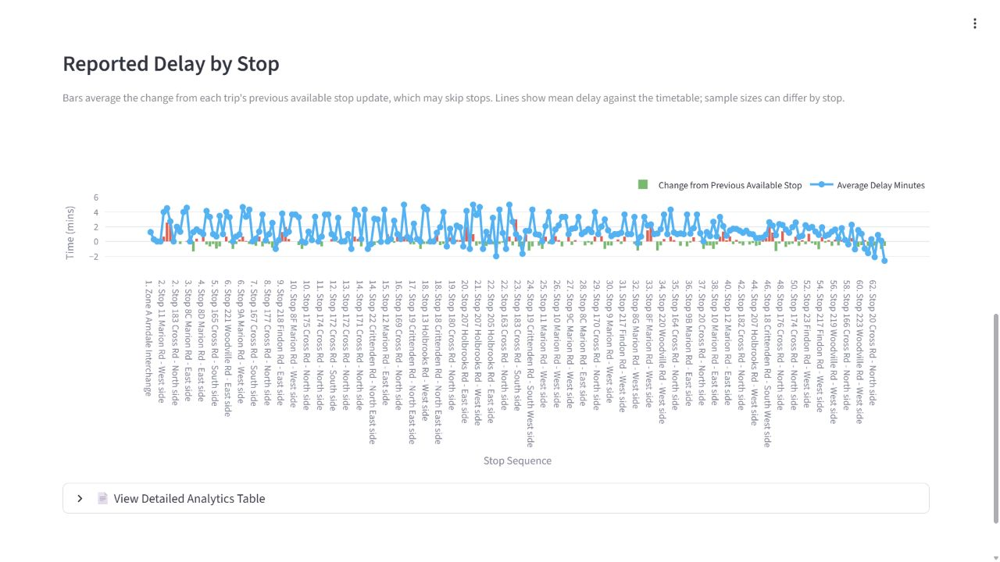

# 🚌 Adelaide Transit Pulse

**Adelaide public transport analytics**


🚀 **[Live Dashboard → CLICK HERE](https://adelaide-metro-162176027068.asia-east2.run.app/)**

Explore Adelaide's public transport network: where scheduled services are busiest, how long routes are, and how delays change along a trip.

---

## Problem Statement

Public transport data often comes as separate timetables and live updates. This project brings them together with Local Government Area (LGA) boundaries — the areas managed by local councils — to explore routes, stops, and scheduled service across Adelaide.

**GTFS** (General Transit Feed Specification) is a standard format for routes, stops, and timetables. **GTFS-Realtime** adds live updates about vehicle locations, expected arrivals, and service alerts.

Python downloads the data, Kafka carries trip updates and polling status, and Bruin prepares BigQuery tables for four Streamlit dashboard tabs. Vehicle-position and service-alert feeds are outside the current analytical scope.

[Architecture](#architecture) · [Dashboard](#dashboard) · [Quick Start](#quick-start) · [Limitations](#limitations)

---

## Architecture


```mermaid
flowchart TD
    STATIC["🌐 Timetables\nStatic GTFS"] --> INGEST["⚙️ Python\nDownload and load"]
    INGEST --> GCS["🪣 Cloud Storage"]
    GCS --> RAW["🗄️ BigQuery · raw"]
    LGA["🗺️ Council boundaries\nLGAs"] --> GEO["⚙️ GeoPandas\nPrepare map boundaries"]
    API["📡 Live updates\nGTFS-Realtime"] --> PROD["☁️ Producer\nFetch and send updates"]
    PROD --> KAFKA["📨 Kafka\nUpdates + polling status"]
    KAFKA --> CONS["☁️ Consumer\nRead and load updates"]
    CONS --> STREAM["🗄️ BigQuery · streaming"]
    RAW --> BRUIN["🔧 Bruin\nClean → combine → dashboard tables"]
    GEO --> BRUIN
    STREAM --> BRUIN
    BRUIN --> APP["☁️ Streamlit Dashboard\nFour tabs"]

    style STATIC fill:#e8f4f8,stroke:#4285F4
    style LGA fill:#e8f4f8,stroke:#4285F4
    style API fill:#e8f4f8,stroke:#4285F4
    style INGEST fill:#fff3e0,stroke:#F97316
    style GEO fill:#fff3e0,stroke:#F97316
    style BRUIN fill:#fff3e0,stroke:#F97316
    style GCS fill:#e3f2fd,stroke:#4285F4
    style RAW fill:#e8eaf6,stroke:#4285F4
    style STREAM fill:#e8eaf6,stroke:#4285F4
    style KAFKA fill:#E52B50,color:#fff,stroke:#E52B50
    style PROD fill:#4285F4,color:#fff,stroke:#4285F4
    style CONS fill:#4285F4,color:#fff,stroke:#4285F4
    style APP fill:#4285F4,color:#fff,stroke:#4285F4
```

- **Batch:** Python loads timetables and council boundaries; Bruin builds BigQuery dimensions, facts and dashboard tables when manually triggered.
- **Realtime:** When enabled for a demo, Cloud Run workers send trip updates through Kafka to BigQuery. Polling runs every minute. Continuous workers and scheduled transformations are disabled by default.
- **Dashboard:** Streamlit reads prepared tables for four views. Model definitions live in [core](bruin/assets/core) and [marts](bruin/assets/marts/dashboard).

---

## Tech Stack

| Layer | Tools |
| --- | --- |
| Data collection & live updates | Python, GeoPandas, Kafka / Aiven |
| File storage & database | Cloud Storage, BigQuery |
| Data processing & scheduling | Bruin, Cloud Scheduler |
| Dashboard | Streamlit, Plotly, pydeck |
| Cloud setup & deployment | Terraform, Docker, Cloud Run, GitHub Actions |

---

## Dashboard

| Tab | Capture | What it shows |
| --- | --- | --- |
| **Network Analytics** |  | Explore stops by council area and transport type, starting with Bus; compare areas by stops, routes and scheduled visits. |
| **Route Lengths** |  | Compare average, shortest and longest mapped route lengths in kilometres. Filter by transport type or search by route/destination. |
| **Scheduled CBD Speed** |  | Timetable-based speed and trip counts for corridors assigned from stop names, by time of day. |
| **Realtime Arrival Delay** |  | Feed-reported arrival delay against the timetable, plus changes between available stop updates. |

Screenshots show the deployed dashboard as of 3 October 2026. Live delay values change with the feed.

---

## Project Structure

```
adelaide-metro/
├── bruin/               # Collect, clean, combine and prepare dashboard data
├── streaming/           # Send and load live updates through Kafka
├── dashboard/           # Streamlit app
├── terraform/           # Google Cloud resources and update schedule
├── .github/workflows/   # Checks, dashboard deployment and manual pipeline run
├── tests/               # Producer/consumer unit tests
└── docs/images/         # Dashboard screenshots
```

---

## Quick Start

Requires Python 3.11, Bruin, Google Cloud credentials and a Kafka broker.

- Set up cloud resources using [Terraform](terraform/main.tf).
- Update project IDs in SQL, the [batch Dockerfile](bruin/Dockerfile) and [workflows](.github/workflows).
- Configure Bruin's `gcp` connection and Kafka credentials for the [producer](streaming/producer.py) and [consumer](streaming/consumer.py).
- Start realtime ingestion, then build the BigQuery tables with `bruin run bruin`.
- Configure GitHub secrets from the [deployment workflow](.github/workflows/deploy.yml) for cloud deployment.

With BigQuery tables populated, run the dashboard locally from Bash or WSL:

```bash
python -m venv .venv
source .venv/bin/activate
python -m pip install -r requirements.txt
gcloud auth application-default login
export GOOGLE_CLOUD_PROJECT="your-project-id"
streamlit run dashboard/App.py
```

The [CI workflow](.github/workflows/ci.yml) validates Bruin, Terraform and Python unit tests on pull requests.

### Operating costs and manual runs

The dashboard can scale to zero and reads the last prepared BigQuery tables. Its data does not update while ingestion and transforms are stopped. Cloud Run requests, BigQuery queries, and stored data can still incur charges.

- The batch workflow runs only through **Run workflow** in GitHub Actions. It rebuilds and executes the batch job; creating the realtime transform job requires selecting `deploy_realtime_transform`.
- Dashboard deployment does not start realtime workers. To start both workers, manually run the deploy workflow with `deploy_workers` selected. Stop or delete them after the demo.
- Terraform defaults `enable_rt_scheduler` to `false`, so applying it does not recreate the realtime schedule. Enable it only after deploying a realtime transform job, and disable it again after use.
- Source trip updates retain only the latest collected day, **5 October 2026** (501,409 rows, approximately 74 MiB logical data). Dashboard tables remain saved from their last successful refresh; their source timestamp can differ from the retained raw sample.
- The dashboard defaults to `DASHBOARD_MODE=demo`, labels saved data, and disables automatic refresh. Set `DASHBOARD_MODE=live` only when live collection and transforms are active.
- Realtime staging defaults to `rt_demo_mode=true` and `rt_demo_date=2026-10-05`. It checks that the saved sample exists and retains deduplication checks, while skipping live freshness checks. Rebuild only the realtime assets with `bruin run bruin/assets/staging/stg_rt_trip_updates.sql --downstream`. To select a different saved day, add `--var rt_demo_date=YYYY-MM-DD`; to restore the live rolling window and freshness checks, add `--var rt_demo_mode=false`.
- Removed container images are rebuilt by the manual workflows. Keep the dashboard's current image when cleaning Artifact Registry.

---

## Limitations

- **Manual setup:** Project IDs are repeated across files; Kafka and parts of cloud deployment require manual configuration.
- **Delivery guarantees:** Kafka-to-BigQuery loading is at least once. Raw records can repeat; staging deduplicates updates, and some failures require intervention.
- **Historical replay:** Static ingestion replaces current data without keeping source versions, limiting reproducible backfills.
- **Freshness and cost:** Scheduled refreshes and caching add latency. Continuous workers and recurring BigQuery queries incur operating costs.
