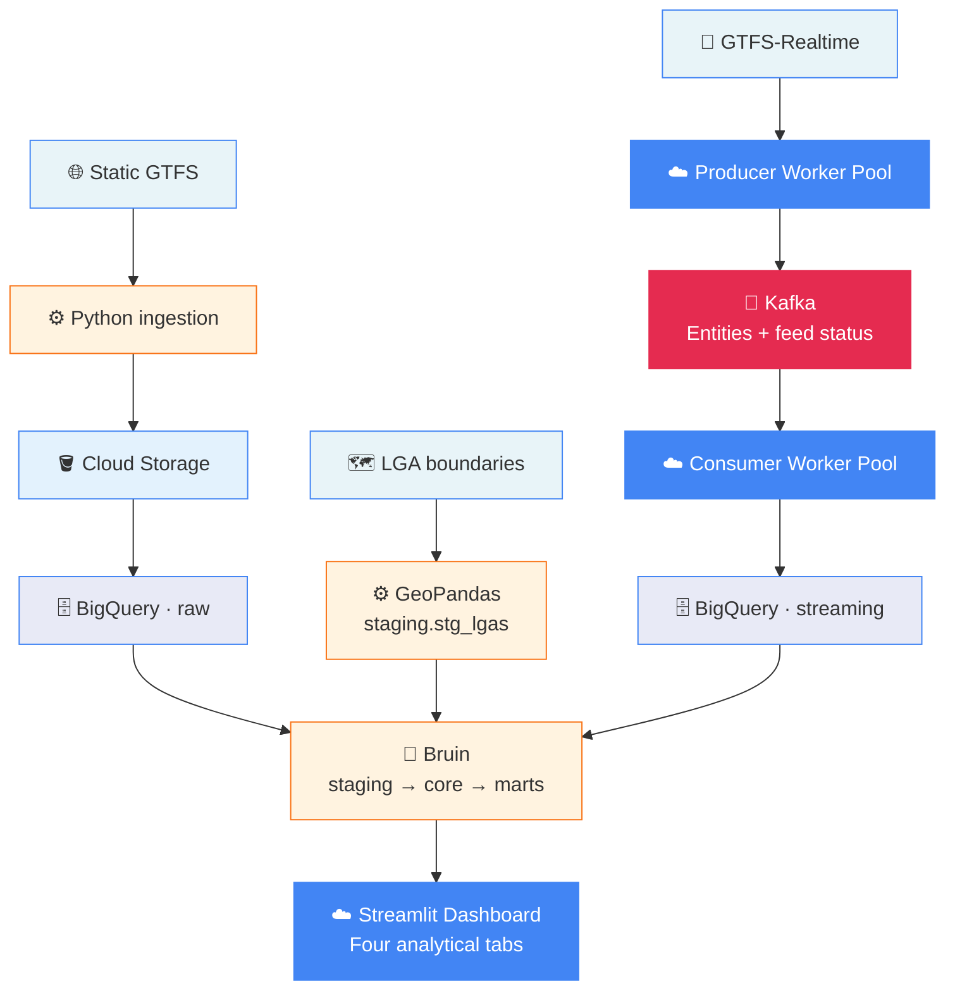
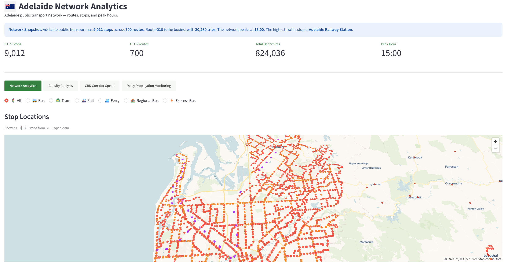
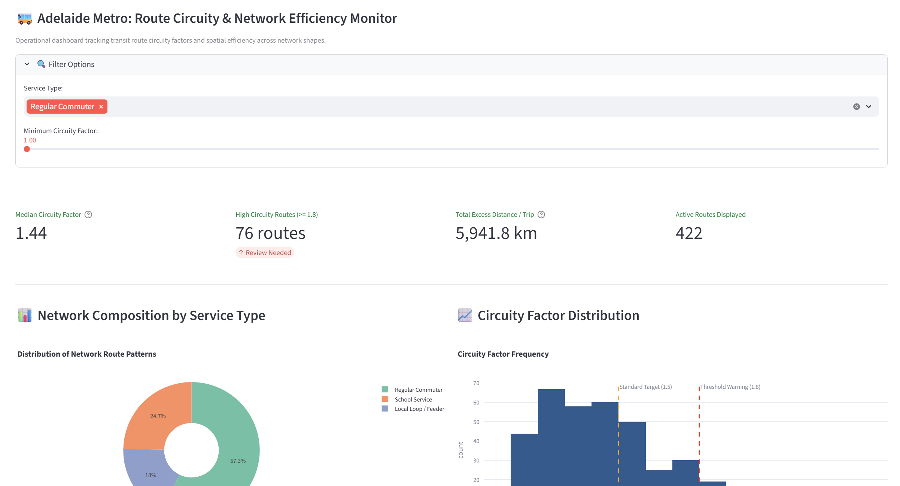
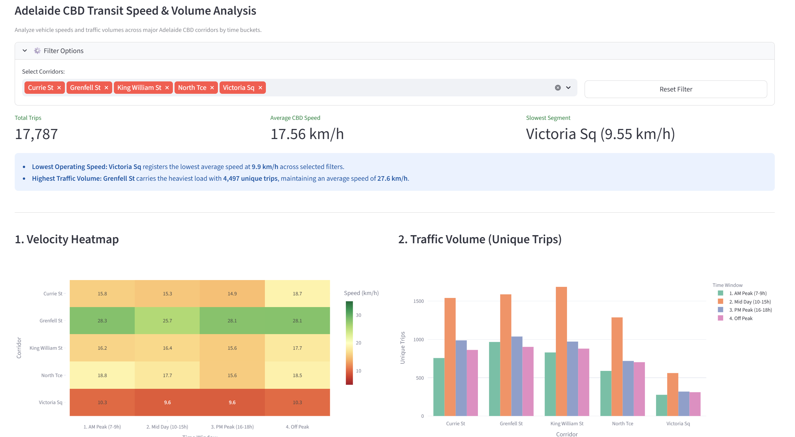
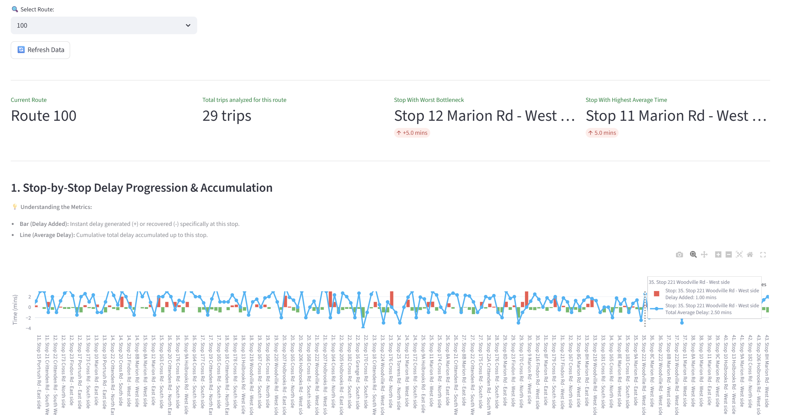
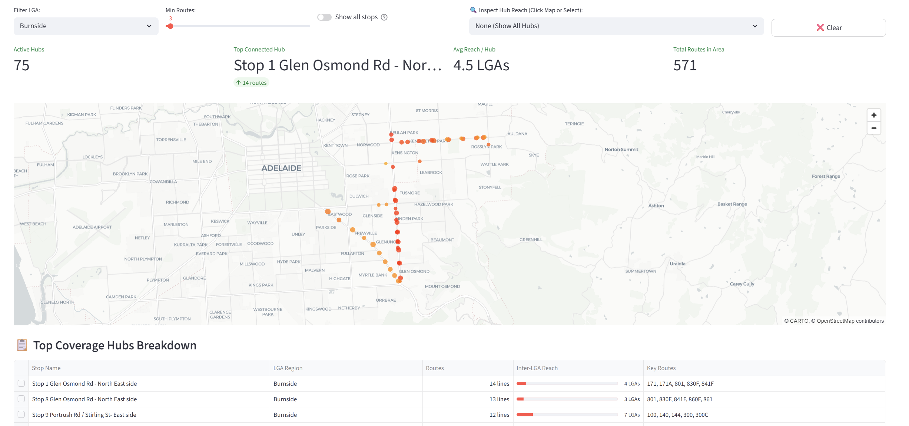
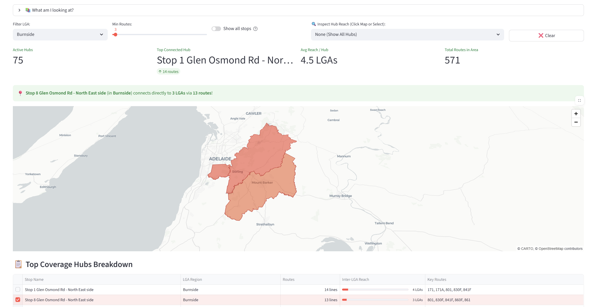
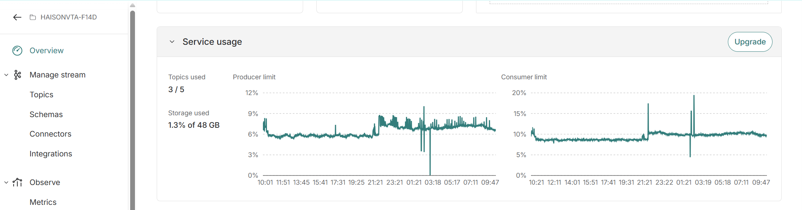
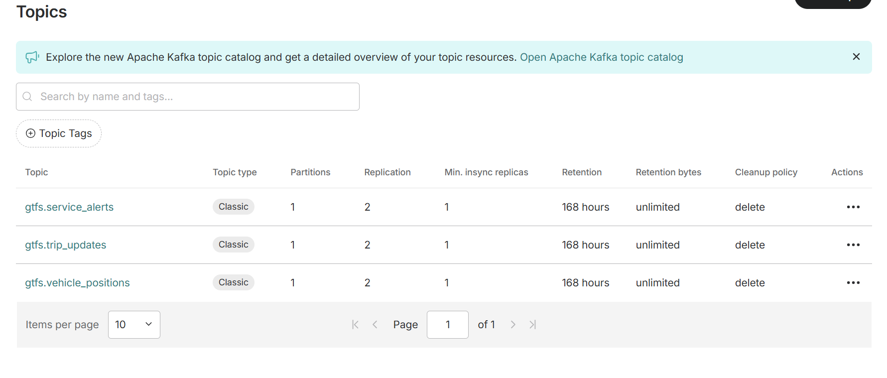

# 🚌 Adelaide Transit Pulse


🚀 **[Live Dashboard → CLICK HERE](https://adelaide-metro-162176027068.asia-east2.run.app/)**

Adelaide Metro timetables and realtime feeds become an interactive dashboard for exploring service coverage, route directness, CBD scheduled speed, and delay propagation.

---

## Problem Statement

Raw transit feeds describe individual trips and stops. This project combines them with South Australian Local Government Area (LGA) boundaries to answer four questions: **where is service concentrated, how direct are routes, how does scheduled speed vary, and where do delays grow or recover?**

The pipeline combines batch ingestion and continuous Kafka transport, transforms data in BigQuery with Bruin, and serves four Streamlit tabs.

[Architecture](#architecture) · [Dashboard](#dashboard) · [Quick Start](#quick-start) · [Setup guide](docs/setup.md) · [Data model](docs/data-model.md)

---

## Architecture


```mermaid
flowchart TD
    STATIC["🌐 Static GTFS"] --> INGEST["⚙️ Python ingestion"]
    INGEST --> GCS["🪣 Cloud Storage"]
    GCS --> RAW["🗄️ BigQuery · raw"]
    LGA["🗺️ LGA boundaries"] --> GEO["⚙️ GeoPandas\nstaging.stg_lgas"]
    API["📡 GTFS-Realtime"] --> PROD["☁️ Producer Worker Pool"]
    PROD --> KAFKA["📨 Kafka\nEntities + feed status"]
    KAFKA --> CONS["☁️ Consumer Worker Pool"]
    CONS --> STREAM["🗄️ BigQuery · streaming"]
    RAW --> BRUIN["🔧 Bruin\nstaging → core → marts"]
    GEO --> BRUIN
    STREAM --> BRUIN
    BRUIN --> APP["☁️ Streamlit Dashboard\nFour analytical tabs"]

    style STATIC fill:#e8f4f8,stroke:#4285F4
    style LGA fill:#e8f4f8,stroke:#4285F4
    style API fill:#e8f4f8,stroke:#4285F4
    style INGEST fill:#fff3e0,stroke:#F97316
    style GEO fill:#fff3e0,stroke:#F97316
    style BRUIN fill:#fff3e0,stroke:#F97316
    style GCS fill:#e3f2fd,stroke:#4285F4
    style RAW fill:#e8eaf6,stroke:#4285F4
    style STREAM fill:#e8eaf6,stroke:#4285F4
    style KAFKA fill:#E52B50,color:#fff,stroke:#E52B50
    style PROD fill:#4285F4,color:#fff,stroke:#4285F4
    style CONS fill:#4285F4,color:#fff,stroke:#4285F4
    style APP fill:#4285F4,color:#fff,stroke:#4285F4
```

GitHub Actions runs the full batch pipeline daily. Producer/consumer Worker Pools run continuously; Cloud Scheduler refreshes the trip-update delay path every five minutes. [Full architecture and refresh details →](docs/data-model.md#architecture)

---

## Tech Stack

| Layer | Tools |
| --- | --- |
| Ingestion & streaming | Python, GeoPandas, Kafka / Aiven |
| Storage & warehouse | Cloud Storage, BigQuery |
| Orchestration | Bruin, Cloud Scheduler |
| Dashboard | Streamlit, Plotly, pydeck |
| Infrastructure & delivery | Terraform, Docker, Cloud Run, GitHub Actions |

---

## Dashboard

| Tab | Capture | What it shows |
| --- | --- | --- |
| **Network Analytics** |  | Scheduled service concentration, busiest routes/stops, and downstream LGA reach. |
| **Circuity Analysis** |  | Route shape length compared with geographic reach, by service class. |
| **CBD Corridor Speed** |  | Scheduled speed and trip volume across CBD corridors and time buckets. |
| **Delay Propagation Monitoring** |  | Arrival delay, added delay between available stops, and recovery along trips. |

Counts describe the loaded timetable, CBD speed is scheduled rather than observed, and realtime arrivals may be predictions. [Metric definitions →](docs/data-model.md#metric-semantics)

<details>
<summary>More screenshots & tech stack diagram</summary>

| Spatial reach | LGA coverage |
| --- | --- |
|  |  |

| Aiven Kafka | Topics |
| --- | --- |
|  |  |

<p align="center">
  
</p>

</details>

---

## Project Structure

```
adelaide-metro/
├── bruin/               # Ingestion → staging → core → marts
├── streaming/           # Continuous Kafka producer and consumer
├── dashboard/           # Streamlit app
├── terraform/           # GCP infrastructure and realtime scheduler
├── .github/workflows/   # Validation, deployment, daily batch
├── tests/               # Producer/consumer unit tests
└── docs/                # Setup, data model, diagrams and screenshots
```

[Detailed directory tree →](docs/data-model.md#project-structure)

---

## Quick Start

**First-time setup:** follow [docs/setup.md](docs/setup.md) to configure GCP, Bruin, Kafka, and the initial warehouse build. SQL currently contains project IDs that must be updated for your own project.

**With an existing warehouse:** from the repository root, using Bash/WSL and Python 3.11:

```bash
python -m venv .venv
source .venv/bin/activate
python -m pip install -r requirements.txt
gcloud auth application-default login
export GOOGLE_CLOUD_PROJECT="your-project-id"
streamlit run dashboard/App.py
```

The dashboard needs the mart tables already built in that project. [Deployment, schedules, and validation →](docs/setup.md#deployment--scheduling)

---

## What Can Be Improved

- Parameterize project IDs and automate the remaining cloud setup.
- Add service-date filtering and versioned static feeds for historical analysis.
- Improve realtime replay handling, worker recovery, and freshness indicators.
- Compare observed vehicle movement with scheduled CBD speeds.

[Pipeline limitations →](docs/data-model.md#what-can-be-improved)
