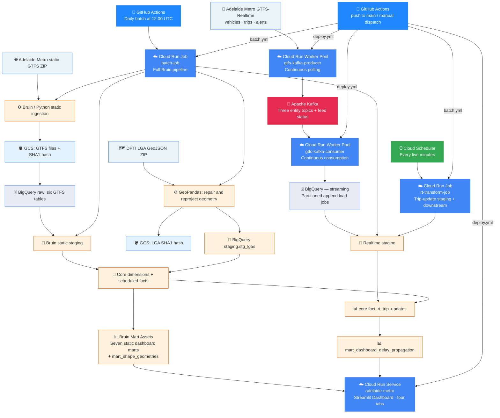

# Data Model & Pipeline

[← Back to README](../README.md) · [Setup guide](setup.md)

The pipeline combines the current public transport timetable, recent live updates, and local council boundaries. Timetable tables describe scheduled services; realtime tables support the latest available delay analysis.

**GTFS** (General Transit Feed Specification) is the standard format for routes, stops, and timetables. **GTFS-Realtime** carries live vehicle locations, expected arrivals, and service alerts. **LGA** means Local Government Area: an area managed by a local council.

The database layers separate source data (`raw` and `streaming`), cleaned data (`staging`), shared reference and event tables (`core`), and tables prepared for the dashboard (`marts`). A **producer** sends updates to Kafka; a **consumer** reads them and loads BigQuery. Cloud Run **Worker Pools** keep these programs running continuously.

---

## Data Sources

The following URLs are configured in the ingestion and producer scripts:

| Source | Input | Use |
| --- | --- | --- |
| Adelaide Metro static GTFS | `https://gtfs.adelaidemetro.com.au/v1/static/latest/google_transit.zip` | Routes, stops, trips, stop times, shapes, and service calendar |
| Realtime vehicle positions | `https://gtfs.adelaidemetro.com.au/v1/realtime/vehicle_positions` | Vehicle coordinates and metadata; polled every 15 seconds |
| Realtime trip updates | `https://gtfs.adelaidemetro.com.au/v1/realtime/trip_updates` | Stop arrival updates; polled every 60 seconds |
| Realtime service alerts | `https://gtfs.adelaidemetro.com.au/v1/realtime/service_alerts` | Alert text and affected routes; polled every 300 seconds |
| DPTI LGA boundaries | `https://www.dptiapps.com.au/dataportal/LGA_geojson.zip` | `LGA_GDA2020.geojson` for stop-to-LGA assignment and hub coverage |

Static GTFS is a ZIP of CSV-formatted text files. GTFS-Realtime uses Protocol Buffers. The producer publishes each serialized `FeedEntity` with fetch/feed timestamp headers and emits JSON polling status to `gtfs.feed_status`.

---

## Ingestion & Transformation

### Static and geographic ingestion

`ingest_gtfs_static.py` compares the downloaded ZIP's SHA1 with a GCS marker and skips unchanged sources. Changed feeds are extracted to `gtfs_static/adelaide-metro/`, checked against explicit headers, and loaded into six `raw.gtfs_*` tables using `WRITE_TRUNCATE`.

`ingest_geo_lgas.py` also skips unchanged sources. It repairs geometries, converts them to WGS84, and loads LGA names and geography into `staging.stg_lgas`. GCS stores its change marker under `geo_lgas/`; this script does not archive the GeoJSON in GCS.

### Realtime ingestion

The producer runs one polling thread per feed. The consumer runs one worker per topic and appends partitioned batches through BigQuery dataframe load jobs. It flushes on an idle poll, at 5,000 rows, or after 30 seconds, and commits Kafka offsets after a successful load.

| Kafka topic | BigQuery table in `streaming` |
| --- | --- |
| `gtfs.vehicle_positions` | `gtfs_realtime_vehicle_positions` |
| `gtfs.trip_updates` | `gtfs_realtime_trip_updates` |
| `gtfs.service_alerts` | `gtfs_realtime_service_alerts` |
| `gtfs.feed_status` | `gtfs_feed_status` |

### Transformation and serving

Bruin builds typed staging tables, six core dimensions, and three facts. Scheduled facts handle GTFS times beyond midnight. Realtime trip staging selects the latest update per service date, trip, stop sequence, and stop; the realtime fact joins those updates to scheduled stop events in Adelaide local time.

## Dashboard Marts

Eight dashboard marts support the app: seven are queried directly, while `mart_dashboard_peak_by_type` feeds the network KPI mart.

| Mart | Purpose |
| --- | --- |
| `mart_dashboard_network_kpi` | Network overview, busiest route/stop, peak hour |
| `mart_dashboard_stop_map` | Stop coordinates and scheduled stop-event counts |
| `mart_dashboard_peak_by_type` | Hourly active trips and first-stop departures by mode |
| `mart_dashboard_route_trip_counts` | Distinct scheduled trips per route |
| `mart_dashboard_coverage_hubs` | Hubs with at least five routes and downstream LGA coverage |
| `mart_dashboard_route_circuity` | Route geometry length, geographic reach, excess distance |
| `mart_dashboard_cbd_corridor_speed` | Scheduled speed and trip volume by corridor/time bucket |
| `mart_dashboard_delay_propagation` | Average delay, added delay, propagation ratio, data timestamp |

`mart_shape_geometries` is an intermediate mart used by circuity analysis. Static dashboard queries generally cache for one hour; delay data caches for five minutes, so feed polling intervals are not dashboard freshness guarantees.

---

## Metric Semantics

- **Timetable counts:** Stop-map `total_departures` counts stop events. Peak-by-type `total_departures` counts first-stop departures; its `total_trips` counts trips active within each clock hour. Summing active trips across hours does not give a daily unique-trip total. The busiest-route KPI uses trip counts.
- **Hub reach:** Eligible hubs have at least five routes. Reach means a downstream stop in another LGA on the same scheduled trip; it does not model journeys requiring transfers. Destination polygons are stored in `connected_lga_polygons` as LGA/GeoJSON structs.
- **Circuity:** The factor compares shape distance with origin-to-farthest-stop reach. Local loop/feeder routes use twice that reach as the baseline. Compare within service classes.
- **CBD speed:** Corridor speed is total stop-to-stop distance divided by total scheduled travel time, converted to km/h. Corridor assignment uses stop-name patterns; segments with nonpositive duration or scheduled speed above 80 km/h are excluded.
- **Delay:** Arrival updates are matched to the timetable in Adelaide local time, including GTFS times beyond midnight. Added delay uses the previous available stop; the propagation ratio uses the first available stop's delay. Updates may be predictions, and these patterns do not establish causation.

## Refresh & Dependencies

The daily full pipeline includes all realtime staging assets. The five-minute `rt-transform-job` starts at `stg_rt_trip_updates` with `--downstream`, rebuilding `fact_rt_trip_updates` and the delay mart. Scheduled core inputs must already exist. Vehicle-position and service-alert staging are not part of that five-minute refresh.

All nine active marts serve the dashboard directly or through dependencies. Seven dashboard marts are queried directly. `mart_dashboard_peak_by_type` supplies the network KPI, while `mart_shape_geometries` supplies circuity. The current shapes mart uses maximum GTFS shape distance as its distance input.

---

## Architecture



The full batch job includes realtime assets. The five-minute job refreshes only `stg_rt_trip_updates` and its downstream fact and delay mart; it does not refresh vehicle-position or service-alert staging.

---

## Project Structure

```
adelaide-metro/
├── Dockerfile                          # Dashboard and streaming image
├── docker-compose.yml                  # Local Kafka broker
├── .bruin.yml.example                  # Root-level Bruin connection template
├── .dockerignore
├── requirements.txt                    # Python dependencies
├── .github/
│   └── workflows/
│       ├── ci.yml                      # PR validation and unit tests
│       ├── deploy.yml                  # CI/CD: dashboard + streaming Worker Pools
│       └── batch.yml                   # CI/CD: build + run batch job (daily at 12:00 UTC)
├── bruin/                              # Batch pipeline (Bruin)
│   ├── Dockerfile                      # Batch container image
│   ├── pipeline.yml                    # Pipeline definition and default connection
│   └── assets/
│       ├── ingestion/
│       │   ├── ingest_gtfs_static.py    # GTFS ZIP -> GCS -> BigQuery
│       │   └── ingest_geo_lgas.py      # LGA geometry -> BigQuery staging
│       ├── staging/
│       │   ├── stg_stops.sql
│       │   ├── stg_routes.sql
│       │   ├── stg_trips.sql
│       │   ├── stg_shapes.sql
│       │   ├── stg_stop_times.sql
│       │   ├── stg_rt_service_alerts.sql
│       │   ├── stg_rt_trip_updates.sql
│       │   ├── stg_rt_vehicle_positions.sql
│       │   └── stg_calendar.sql
│       ├── core/
│       │   ├── dimensions/
│       │   │   ├── dim_lgas.sql
│       │   │   ├── dim_services.sql
│       │   │   ├── dim_shapes.sql
│       │   │   ├── dim_stops.sql
│       │   │   ├── dim_routes.sql
│       │   │   └── dim_trips.sql
│       │   └── facts/
│       │       ├── fact_scheduled_stop_events.sql
│       │       ├── fact_scheduled_route_segments.sql
│       │       └── fact_rt_trip_updates.sql
│       └── marts/
│           ├── mart_shape_geometries.sql
│           └── dashboard/
│               ├── mart_dashboard_cbd_corridor_speed.sql
│               ├── mart_dashboard_coverage_hubs.sql
│               ├── mart_dashboard_delay_propagation.sql
│               ├── mart_dashboard_network_kpi.sql
│               ├── mart_dashboard_peak_by_type.sql
│               ├── mart_dashboard_route_circuity.sql
│               ├── mart_dashboard_route_trip_counts.sql
│               └── mart_dashboard_stop_map.sql
├── dashboard/
│   ├── App.py                          # Streamlit dashboard (4 tabs)
│   └── au-flag.png
├── streaming/
│   ├── producer.py                     # Continuous GTFS-RT polling -> Kafka
│   └── consumer.py                     # Continuous Kafka -> BigQuery load jobs
├── tests/                              # Producer and consumer unit tests
├── docs/
│   ├── setup.md                        # Local setup, deployment and validation
│   ├── data-model.md                   # Pipeline, metrics and dependencies
│   └── images/                         # Stack diagram and screenshots
└── terraform/
    ├── main.tf                         # GCS + BigQuery + IAM + RT scheduler
    ├── variables.tf
    ├── outputs.tf
    └── terraform.tfvars.example
```

---

## What Can Be Improved

- **Configuration portability:** Parameterize project IDs across SQL, containers, and workflows so one configuration controls the target project.
- **Timetable semantics:** Current network counts summarize the loaded feed. Add service-date filtering and `calendar_dates.txt` exceptions before presenting daily operational totals.
- **Realtime delivery:** Warehouse loads and Kafka offset commits are separate operations, so replay can append duplicates. Trip staging deduplicates its latest records; add broader replay handling and worker recovery.
- **Freshness:** Polling status and delay timestamps are available, but feed polling, warehouse loading, five-minute transforms, and dashboard caching each contribute latency. Add a consistent freshness indicator across tabs.
- **Historical analysis:** Static ingestion replaces current tables and retains a source hash rather than versioned snapshots. Archive feed versions for reproducible historical comparisons.
- **Observed performance:** CBD speed currently uses the timetable. Extend vehicle-position modeling to compare observed movement with scheduled speed.
- **Deployment completeness:** Automate the remaining WIF, Kafka, repository, and API setup, and align the dashboard service account with its read-only role.
- **Cost control:** BigQuery queries, load jobs, continuously running Worker Pools, and the dashboard's minimum instance require a project-specific cost budget; this configuration does not guarantee free-tier operation.
